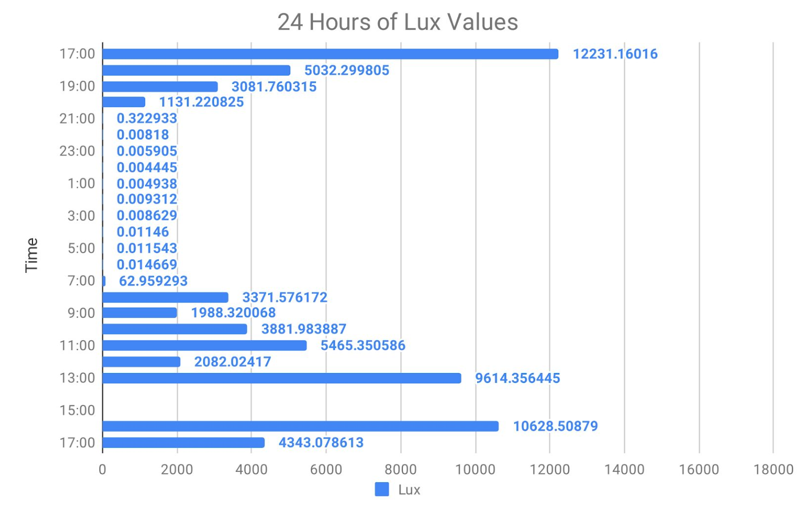

# Light Sensor Embedded System Project
This project was developed for an engineering service project at Indiana University in Spring 2019. It was designed for a low-power, low cost light pollution monitoring system for Hoosier National Forest.
The code is designed to run on a custom embedded system based on the [STM32L432KC MCU](https://www.digikey.com/product-detail/en/stmicroelectronics/STM32L432KCU6/497-16578-ND/6132749).
The board also has a [TSL25911FN](https://www.digikey.com/product-detail/en/ams/TSL25911FN/TSL25911FNTR-ND/4162547) light-to-digital converter,
and was powered by a [coin-cell battery](https://data.energizer.com/pdfs/cr2032.pdf). The board takes light sample readings and converts the data to Lux and stores it to the built in flash memory every hour. When it is not in use, the MCU goes into a low power mode. The current conservative estimate for battery life with the above specs and code is approximately 73 days, but it could certainly be longer with further optimization.

A working prototype of this board was designed and made by myself (Nathan Schellink), and my partner, Levi Beyers.
Much of the base code for the drivers was generated through [STM32CubeMX](https://www.st.com/en/development-tools/stm32cubemx.html).

## Tools Used
- [Kicad](http://www.kicad-pcb.org/) - Schematics, PCB layout and design
- OpenOCD/GDB - Debugging
- [OpenSCAD](https://www.openscad.org/) - Design for 3D printed enclosure
- Git - Version control
- Oscilloscope - Hardware Debugging
- Emacs - Text editor
- [STM32CubeMX](https://www.st.com/en/development-tools/stm32cubemx.html) - STM32 Project Code initializer
- Programming Language: C
- Toolchain/Compiler: Compiled with the [GNU Arm Embedded Toolchain](https://developer.arm.com/tools-and-software/open-source-software/developer-tools/gnu-toolchain/gnu-rm/downloads)

## Data Collected From Board Test Run
This test was conducted over a unsupervised 24 hour  period outside in a rural area. The data was then collected via USB and put into a graph displayed below. The lux values are consistent with what one would expect at night and during the daytime so the calibration was fairly accurate, even for very low and very high lux values.

## Acknowledgements
Special thanks to  Hoosier National Forest and Bryce Himebaugh for being our mentor.
